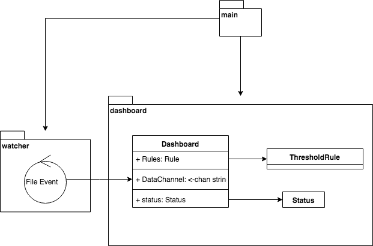

# HTTP log monitoring console program



```go
go run cmd/timbersaw/timbersaw.go -help
Usage of timbersaw:
  -path string
    	Path of Logs (default "/var/log/nginx/")
  -rate uint
    	Refresh Rate of dashboard (default 10)
  -threshold uint
    	Alert threshold (default 1200)
  -window uint
    	Monitor period (default 120)
exit status 2
```

## Main Features

- Living monitor for local files.
- Extendable format support.
- Test cases coverage major part.

This little console application demonstrates how to gracefully handle log files and provide extendability for future improvement.

## Defect and Improvement

1. No continuous processing support after the app restart. It reprocesses complete data every time.
   
   We can add a position memory function to mark where it has been processed.
   
2. A long period of use case might cause a memory issue.

   I'm using a `container/ring` as the data structure to compute how much status remain. Considering two sides, it's a little bit costly. 
   On the memory cost side, it requires a ring bucket object per second(in our case). 
   On the runtime cost side, it's inefficient. Many operators just for typecasting, it can be improved by developing a type related ring.
